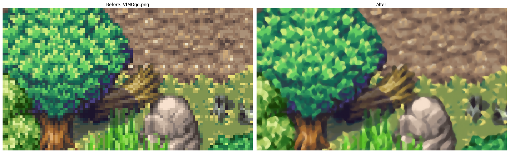
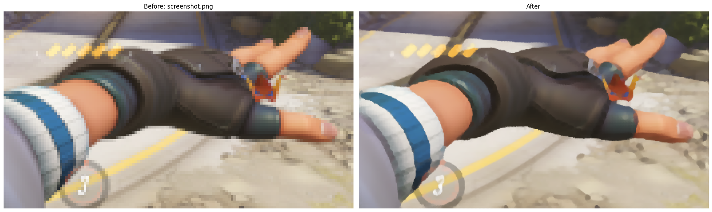
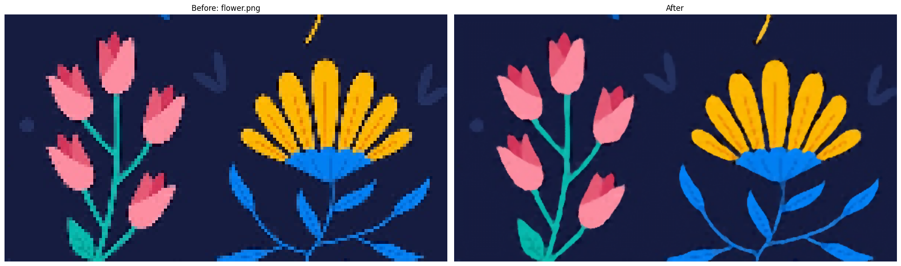

# NanoScaler-3k

A tiny fully convolutional image upscaler designed for stylized inputs such as pixel art or game screenshots. Trained on Roblox and Genshin Impact Screenshots.
This model preserves sharp edges while reducing blocky artifacts and improving perceptual smoothness.
It has been optimized for 2x and 4x upscaling, whereby, for 4x upscaling, the model is simply applied a second time to its own output.

---

## ✨ Overview

This model performs structure aware interpolation using a convex combination of local neighborhoods, also known as **convex upsampling** where the network predicts spatially adaptive weights for interpolation.

Key idea:

- Each output pixel is a weighted combination of a 3×3 neighborhood
- Weights are learned and normalized via softmax (convex constraint)
- Multi-stage upscaling improves stability and detail recovery

---

## 🎯 Key Features

* Sharp edge preservation for pixel-art-like content
* Reduced checkerboard and blocky artifacts
* Multi-scale consistency (x2 and x4 training)
* Temperature-controlled softmax sharpening

---

## 🖼️ Results

### Pixel Art Upscaling

### Game Screenshot Upscaling

### Stylised Image Upscaling

---

## Architecture

### Core Components

- **SharedConv2d**
  - Channel-wise weight sharing convolution on the rgb input
- **Residual Connections**
  - Lightweight squeeze-expand residual blocks
- **Recursive Residual Blocks**
  - Two-pass refinement for improved nonlinear learning capacity
- **PixelShuffle refinement**
  - Improves local consistency before weight prediction
- **Convex Upsampling**
  - 3×3 neighborhood interpolation with learned weights

---

## 📦 Dataset

The model was trained on stylized gameplay datasets:

- Roblox gameplay frames
- Genshin Impact screenshots

---

## ⚙️ Training Details

### Data Pipeline

* HR resolution: 160px patches
* Random blur + downsampling (nearest / bilinear mix)
* Gaussian blur augmentation for robustness
* Noise injection for generalization

### Loss Function

* Smooth L1 loss (early training)
* Switch to L1 loss after convergence phase
* Additional **blocky artifact penalty**

### Optimization

* Optimizer: AdamW
* Scheduler: CosineAnnealingLR
* Epochs: ~330
* Batch size: 8

---

## 📌 Notes

This model is especially effective for:

* Pixel art upscaling
* Stylized game screenshots
* Non-photorealistic textures

It is not optimized for:

* Real-world photography super-resolution
* Faces / natural image restoration

---

## 📜 License: MIT
